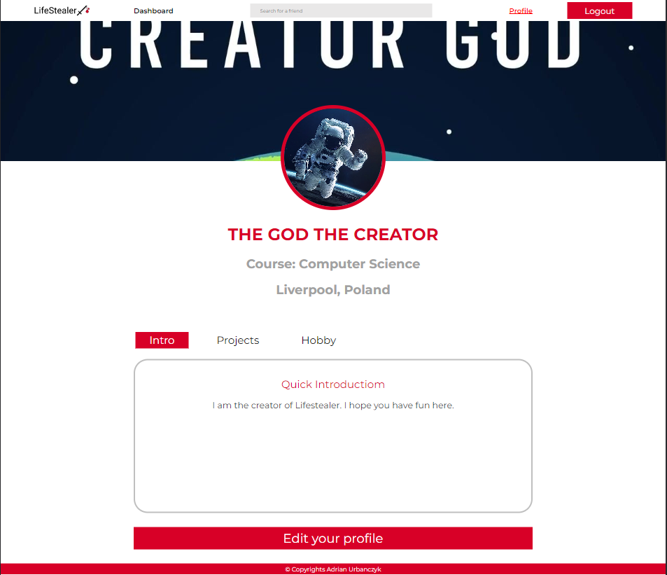

# Lifestealer Social Media Platform

Lifestealer is a simple social media platform built with React and Express.js. User can add posts, add friends to friends list and have a chat with them! The app does not support small screens.

This repo contains backend and client code of the entire project.

## Project snaphots

## **Login Snapshot**

## **Feed Snapshot**

## **Profile Snapshot**

## **New Post Snapshot**

## **Edit Profile Snapshot**

## **Post Like And Comments Snapshot**

## **Feed With Chats Snapshot**

The app is avaiable live at: https://lifestealer.herokuapp.com/
